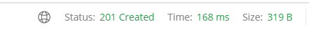
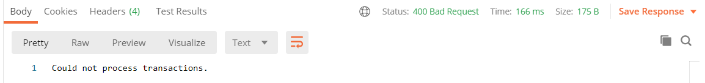
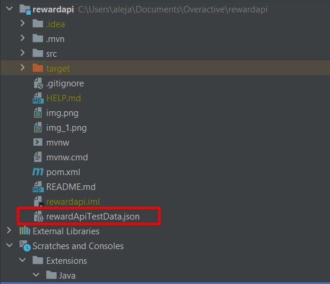

# RewardsApi

This API receives a set of transactions and calculates the reward points granted
each customer.

Each transaction must contain the following:
1. customerId - If of the customer who completed the purchase.
2. date - Date of the transaction (yyyy-MM-dd)
3. amount - Total of the purchase

By sending a POST request to the following endpoint
http://localhost:8083/api/transaction/
```
[
{
    
      "customerId": 1,
      "date": "2021-10-15",
      "amount": 250

},
{
    
      "customerId": 1,
      "date": "2021-11-15",
      "amount": 120

},
{
       "customerId": 2,
      "date": "2021-11-15",
      "amount": 250

}
]
```
The result will be the calculation of the total reward points,
and the record of the reward points earned per month, for each customer.

```
[
    {
        "customerId": 1,
        "rewardPoints": 440,
        "rewardRecord": {
            "OCTOBER": 350,
            "NOVEMBER": 90
        }
    },
    {
        "customerId": 2,
        "rewardPoints": 350,
        "rewardRecord": {
            "NOVEMBER": 350
        }
    }
]
```
If the transactions are processed and the reward points record is created successfully,
a created status will be shown.



If the record of transactions is not processed correctly, an error message will be displayed
along with the Bad Request response.




#Build
To Build:
'mvn install' will run tests and build the application.

To Run:
'mvn spring-boot:run' will run the application and you can proceed,
to sending the requests described above.

#Test Data
To Test the API, a json file containing test data has been provided in the root of the project.
